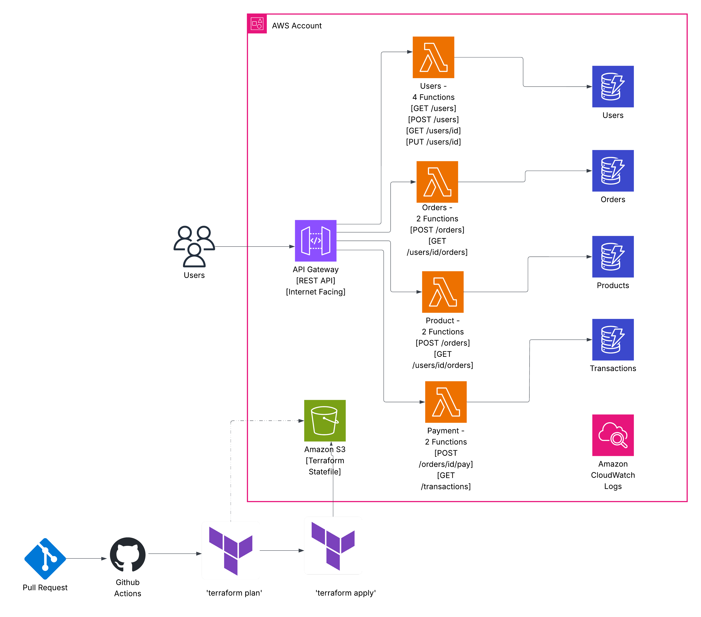

# AWS SecurityAgent Demo 🔐

[](https://opensource.org/licenses/MIT)
[](https://www.terraform.io/)
[](https://aws.amazon.com/)
[](https://www.python.org/)

> **⚠️ WARNING**: This repository contains **100+ intentional security vulnerabilities** for educational purposes. Never deploy this code in production environments.

An enterprise-scale e-commerce platform intentionally designed with security vulnerabilities to demonstrate AWS Security Agent's capabilities in detecting, analyzing, and prioritizing security issues across infrastructure, application code, and CI/CD pipelines.

## 📋 Table of Contents

- [Overview](#overview)
- [Architecture](#architecture)
- [Business Domains](#business-domains--endpoints)
- [Security Vulnerabilities](#intentional-security-issues-by-category)
- [Infrastructure Organization](#infrastructure-organization-terraform-best-practices)
- [Getting Started](#getting-started)
- [Documentation](#documentation)
- [Contributing](#contributing)
- [License](#license)

## 🎯 Overview

This demo simulates a comprehensive enterprise e-commerce platform with multiple business domains, intentionally designed with **100+ security vulnerabilities and operational issues** across infrastructure, application code, and CI/CD pipeline.

### Why This Project?

This repository serves as a comprehensive demonstration for:

- **Security Professionals**: Understanding enterprise-scale vulnerability detection
- **DevOps Engineers**: Learning AWS security best practices through anti-patterns
- **Solution Architects**: Analyzing cross-domain security issues
- **AWS Security Agent**: Showcasing automated security assessment capabilities

### Key Statistics

- 🔴 **100+ Security Vulnerabilities** across 6 categories
- 🏗️ **11 Lambda Functions** handling business logic
- 🌐 **11 API Endpoints** with no authentication
- 💾 **4 DynamoDB Tables** with mixed configurations
- 📊 **Inconsistent Monitoring** (1 day to 7 years log retention)
- 💰 **Cost Optimization Issues** (over/under-provisioned resources)

## 🏛️ Architecture

### Technology Stack

| Component            | Technology         | Configuration                                  |
| -------------------- | ------------------ | ---------------------------------------------- |
| **API Layer**  | Amazon API Gateway | REST API, 11 endpoints, no authentication ⚠️ |
| **Compute**    | AWS Lambda         | 11 functions, Python 3.11, varying resources   |
| **Database**   | Amazon DynamoDB    | 4 tables, mixed billing modes                  |
| **Monitoring** | Amazon CloudWatch  | Inconsistent retention (1 day - 7 years) ⚠️  |
| **IAM**        | AWS IAM            | Single overly-permissive role ⚠️             |
| **IaC**        | Terraform          | Modular structure, 7 organized files           |

### Architecture Diagram


*Complete architecture showing all 11 endpoints, Lambda functions, DynamoDB tables, and security gaps*

## 📁 Infrastructure Organization (Terraform Best Practices)

The infrastructure code follows Terraform best practices with modular organization:

```
infrastructure/
├── main.tf                 # Main orchestration and documentation
├── providers.tf           # Terraform and AWS provider configuration
├── variables.tf           # Input variables and defaults
├── outputs.tf             # Output values and API endpoints
├── terraform.tfvars       # Environment-specific values
├── dynamodb.tf            # DynamoDB tables and GSI configurations
├── iam.tf                 # IAM roles, policies, and attachments
├── lambda.tf              # Lambda functions and environment variables
├── api_gateway.tf         # API Gateway resources, methods, and integrations
├── lambda_permissions.tf  # Lambda-API Gateway integration permissions
└── cloudwatch.tf          # CloudWatch log groups and retention policies
```

**Benefits of Modular Structure:**

- **Maintainability**: Easier to locate and modify specific resource types
- **Readability**: Clear separation of concerns across AWS services
- **Collaboration**: Multiple team members can work on different modules
- **Security Review**: Simplified security assessment by service category
- **Debugging**: Faster troubleshooting with focused resource groupings

## 🛒 Business Domains & Endpoints

#### 👥 User Management

- `GET /users` - List all users (with pagination)
- `GET /users/{userId}` - Get specific user
- `POST /users` - Create new user
- `PUT /users/{userId}` - Update existing user
- `DELETE /users/{userId}` - Delete user

#### 🛍️ Product Catalog

- `GET /products` - List products (with category filtering)
- `GET /products/{productId}` - Get product details

#### 📋 Order Management

- `POST /orders` - Create new order
- `GET /users/{userId}/orders` - Get user's order history

#### 💳 Payment & Financial

- `POST /orders/{orderId}/payment` - Process payment (PCI nightmare)
- `GET /transactions` - Access all financial transactions

## 🚨 Intentional Security Issues by Category

All vulnerabilities are mapped to official AWS security best practices documentation.

#### 🔐 Authentication & Authorization (15+ issues)

**Violates AWS API Gateway Security Best Practices:**

- **No authentication on any endpoint** - AWS recommends implementing least privilege access using IAM policies, Lambda authorizers, or Amazon Cognito user pools
- **No user authorization checks** - Missing resource-based access controls as recommended in AWS security best practices
- **Anyone can access any user's data** - Violates AWS principle of least privilege access
- **Financial data publicly accessible** - Critical compliance violation against AWS security guidelines
- **No admin role validation** - Missing role-based access controls

*Reference: [AWS API Gateway Security Best Practices](https://docs.aws.amazon.com/apigateway/latest/developerguide/security-best-practices.html) - AWS recommends implementing least privilege access, controlling API access through IAM policies, Lambda authorizers, IAM tags, VPC endpoint policies, and Amazon Cognito user pools. AWS also recommends implementing CloudWatch alarms for monitoring metrics over time, enabling AWS CloudTrail for audit logging, and using AWS Config for compliance validation.*

#### 🛡️ Data Security (20+ issues)

**Violates AWS DynamoDB Security Best Practices:**

- **No encryption at rest or in transit** - AWS DynamoDB security best practices emphasize encryption at rest using AWS KMS keys and encryption in transit
- **Payment card data in plain text logs** - Severe PCI DSS compliance violation and AWS logging security failure
- **No PCI DSS compliance measures** - Missing required financial data protection controls
- **Financial data mixed with user data** - Violates AWS data classification and separation principles
- **No data masking or field filtering** - Exposes sensitive information unnecessarily
- **No client-side encryption** - AWS recommends considering client-side encryption for sensitive data using AWS Database Encryption SDK

*Reference: [AWS DynamoDB Security Best Practices](https://docs.aws.amazon.com/amazondynamodb/latest/developerguide/best-practices-security-preventative.html) - AWS provides comprehensive security features including encryption at rest with AWS KMS, IAM roles for authentication, IAM policies for fine-grained access control, VPC endpoints for network security, and client-side encryption for sensitive data protection.*

#### ⚡ Infrastructure Misconfigurations (25+ issues)

**Violates AWS DynamoDB Best Practices:**

- **DynamoDB throttling (5 RCU/WCU on users table)** - Insufficient capacity planning against AWS best practices for workload distribution
- **Over-provisioned transactions table (100 RCU/50 WCU)** - Cost inefficient resource allocation violating AWS cost optimization principles
- **Mixed billing modes across tables** - Inconsistent capacity management strategy across business domains
- **No auto-scaling policies** - Missing dynamic capacity adjustment recommended by AWS
- **Inconsistent log retention (1 day to 7 years)** - Poor operational governance and compliance management
- **No VPC endpoints** - Missing network security controls recommended for DynamoDB access

*Reference: [AWS DynamoDB Best Practices](https://docs.aws.amazon.com/amazondynamodb/latest/developerguide/best-practices.html) - AWS recommends optimizing DynamoDB workloads with proper partition key design, capacity planning, consistent configuration across tables, and using VPC endpoints for secure access.*

#### 🔧 Application Security (20+ issues)

**Violates AWS Lambda Best Practices:**

- **No input validation anywhere** - Missing request validation mechanisms recommended by AWS
- **Generic error handling exposing internals** - Security information disclosure violating AWS security guidelines
- **No retry logic or circuit breakers** - Poor resilience patterns against AWS Lambda best practices
- **Cross-table access without validation** - Overly broad data access violating principle of least privilege
- **No fraud detection on payments** - Missing financial security controls for payment processing
- **Overly permissive IAM roles** - Single role with excessive permissions violating least privilege principle
- **No environment variable encryption** - Missing security for configuration data

*Reference: [AWS Lambda Best Practices](https://docs.aws.amazon.com/lambda/latest/dg/best-practices.html) - AWS recommends initializing SDK clients outside handlers, using environment variables for configuration, implementing proper error handling, avoiding recursive invocations, using most-restrictive IAM permissions, writing idempotent code, and implementing structured JSON logging for better observability.*

#### 📊 Monitoring & Observability (15+ issues)

**Violates AWS CloudWatch and Security Best Practices:**

- **No CloudWatch alarms** - Missing proactive monitoring recommended by AWS security best practices
- **No X-Ray tracing** - Lack of distributed tracing for debugging and performance monitoring
- **No custom metrics** - Missing business-specific monitoring and operational insights
- **No audit logging for financial access** - Compliance and security gap violating AWS audit requirements
- **No performance monitoring** - Missing operational insights and performance optimization
- **No structured JSON logging** - Missing observability best practices recommended by AWS
- **No Cost Anomaly Detection** - Missing cost monitoring recommended by AWS

*Reference: [AWS API Gateway Security Best Practices](https://docs.aws.amazon.com/apigateway/latest/developerguide/security-best-practices.html) and [AWS Lambda Best Practices](https://docs.aws.amazon.com/lambda/latest/dg/best-practices.html) - AWS recommends implementing CloudWatch alarms for monitoring metrics over time, enabling AWS CloudTrail for audit logging, using AWS Config for compliance validation, implementing structured JSON logging, and using Cost Anomaly Detection for unusual activity monitoring.*

#### 🚀 CI/CD Security (10+ issues)

**Violates AWS Security and Deployment Best Practices:**

- **Auto-approve deployments** - Missing human review for critical changes violating AWS security practices
- **No security scanning** - Missing vulnerability assessment in deployment pipeline
- **No dependency checks** - Potential supply chain vulnerabilities in Lambda functions
- **All functions in single package** - Poor separation of concerns violating AWS Lambda best practices
- **No rollback mechanisms** - Missing deployment safety measures and error recovery
- **No Infrastructure as Code security scanning** - Missing Terraform security validation
- **No AWS Config compliance monitoring** - Missing resource configuration validation

*Reference: [AWS Lambda Best Practices](https://docs.aws.amazon.com/lambda/latest/dg/best-practices.html) and [AWS API Gateway Security Best Practices](https://docs.aws.amazon.com/apigateway/latest/developerguide/security-best-practices.html) - AWS recommends proper function packaging, security scanning, dependency management, implementing deployment safety measures including rollback capabilities, using AWS Config for compliance validation, and enabling AWS Security Hub CSPM for security monitoring.*

## 🚀 Getting Started

### Prerequisites

Before deploying, ensure you have:

- ✅ **AWS Account** (use a test/demo account, not production)
- ✅ **AWS CLI** installed and configured with credentials
- ✅ **Terraform** >= 1.0 installed
- ✅ **Python 3.11** (for local testing)
- ✅ **zip** utility (for Lambda packaging)

### Deployment Methods

#### Method 1: GitHub Actions (Recommended)

The easiest way to deploy is using the included GitHub Actions workflow:

1. **Fork this repository** to your GitHub account
2. **Configure GitHub Secrets**:

   - Go to Settings → Secrets and variables → Actions
   - Add the following secrets:
     - `AWS_ACCESS_KEY_ID`: Your AWS access key
     - `AWS_SECRET_ACCESS_KEY`: Your AWS secret key
3. **Push to main branch** or create a pull request:

   ```bash
   git push origin main
   ```
4. **Monitor deployment** in the Actions tab

The workflow will automatically:

- Package all 11 Lambda functions
- Deploy infrastructure with Terraform
- Update Lambda function code
- Add sample data to DynamoDB tables
- Output API endpoints for testing

#### Method 2: Manual Terraform Deployment

For local deployment and testing:

**Step 1: Clone the repository**

```bash
git clone https://github.com/YOUR_USERNAME/AWS-SecurityAgent-Demo.git
cd AWS-SecurityAgent-Demo
```

**Step 2: Configure AWS credentials**

```bash
aws configure
# Verify your identity
aws sts get-caller-identity
```

**Step 3: Package Lambda functions**

```bash
# Create deployment package with all 11 Lambda functions
zip -j lambda_deployment.zip \
  src/get_user.py \
  src/create_user.py \
  src/update_user.py \
  src/delete_user.py \
  src/list_users.py \
  src/list_products.py \
  src/get_product.py \
  src/create_order.py \
  src/get_user_orders.py \
  src/process_payment.py \
  src/get_transactions.py

# Move to infrastructure directory
mv lambda_deployment.zip infrastructure/
```

**Step 4: Configure Terraform variables**

```bash
cd infrastructure

# Edit terraform.tfvars with your settings
# Default values:
# environment = "demo"
# aws_region  = "us-east-1"
```

**Step 5: Deploy infrastructure**

```bash
# Initialize Terraform
terraform init

# Review the deployment plan
terraform plan

# Deploy (type 'yes' when prompted)
terraform apply
```

**Step 6: Update Lambda function code**

```bash
# Get function names from Terraform outputs
GET_USER_FUNCTION=$(terraform output -raw get_user_function_name)
CREATE_USER_FUNCTION=$(terraform output -raw create_user_function_name)
UPDATE_USER_FUNCTION=$(terraform output -raw update_user_function_name)
DELETE_USER_FUNCTION=$(terraform output -raw delete_user_function_name)
LIST_USERS_FUNCTION=$(terraform output -raw list_users_function_name)
LIST_PRODUCTS_FUNCTION=$(terraform output -raw list_products_function_name)
GET_PRODUCT_FUNCTION=$(terraform output -raw get_product_function_name)
CREATE_ORDER_FUNCTION=$(terraform output -raw create_order_function_name)
GET_USER_ORDERS_FUNCTION=$(terraform output -raw get_user_orders_function_name)
PROCESS_PAYMENT_FUNCTION=$(terraform output -raw process_payment_function_name)
GET_TRANSACTIONS_FUNCTION=$(terraform output -raw get_transactions_function_name)

# Update all Lambda functions
aws lambda update-function-code --function-name $GET_USER_FUNCTION --zip-file fileb://lambda_deployment.zip
aws lambda update-function-code --function-name $CREATE_USER_FUNCTION --zip-file fileb://lambda_deployment.zip
aws lambda update-function-code --function-name $UPDATE_USER_FUNCTION --zip-file fileb://lambda_deployment.zip
aws lambda update-function-code --function-name $DELETE_USER_FUNCTION --zip-file fileb://lambda_deployment.zip
aws lambda update-function-code --function-name $LIST_USERS_FUNCTION --zip-file fileb://lambda_deployment.zip
aws lambda update-function-code --function-name $LIST_PRODUCTS_FUNCTION --zip-file fileb://lambda_deployment.zip
aws lambda update-function-code --function-name $GET_PRODUCT_FUNCTION --zip-file fileb://lambda_deployment.zip
aws lambda update-function-code --function-name $CREATE_ORDER_FUNCTION --zip-file fileb://lambda_deployment.zip
aws lambda update-function-code --function-name $GET_USER_ORDERS_FUNCTION --zip-file fileb://lambda_deployment.zip
aws lambda update-function-code --function-name $PROCESS_PAYMENT_FUNCTION --zip-file fileb://lambda_deployment.zip
aws lambda update-function-code --function-name $GET_TRANSACTIONS_FUNCTION --zip-file fileb://lambda_deployment.zip
```

**Step 7: Get API endpoint**

```bash
# Display API endpoint
terraform output api_endpoint

# Save to environment variable
export API_ENDPOINT=$(terraform output -raw api_endpoint)
```

### Testing the API

Once deployed, test the endpoints:

**User Management:**

```bash
# List all users
curl $API_ENDPOINT/users

# Get specific user
curl $API_ENDPOINT/users/user123

# Create new user
curl -X POST $API_ENDPOINT/users \
  -H 'Content-Type: application/json' \
  -d '{"userId":"user999","name":"Test User","email":"test@example.com","status":"active"}'

# Update user
curl -X PUT $API_ENDPOINT/users/user123 \
  -H 'Content-Type: application/json' \
  -d '{"name":"Updated Name","email":"updated@example.com"}'

# Delete user
curl -X DELETE $API_ENDPOINT/users/user123
```

**Product Catalog:**

```bash
# List all products
curl $API_ENDPOINT/products

# Get specific product
curl $API_ENDPOINT/products/prod001

# Filter by category
curl "$API_ENDPOINT/products?category=electronics"
```

**Order Management:**

```bash
# Create order
curl -X POST $API_ENDPOINT/orders \
  -H 'Content-Type: application/json' \
  -d '{"userId":"user123","items":[{"productId":"prod001","quantity":1}]}'

# Get user orders
curl $API_ENDPOINT/users/user123/orders
```

**Payment Processing (demonstrates security issues):**

```bash
# Process payment - NOTICE: No authentication required!
curl -X POST $API_ENDPOINT/orders/order002/payment \
  -H 'Content-Type: application/json' \
  -d '{
    "userId":"user456",
    "amount":299.99,
    "paymentMethod":"credit_card",
    "cardNumber":"4111111111111111",
    "cvv":"123",
    "expiryDate":"12/25"
  }'

# Get all transactions - NOTICE: Anyone can access financial data!
curl $API_ENDPOINT/transactions
```

### Infrastructure Files Overview

The modular Terraform structure:

- **`main.tf`**: Orchestration and documentation (no resources)
- **`dynamodb.tf`**: All 4 DynamoDB tables with intentional misconfigurations
- **`iam.tf`**: IAM roles and policies with overly broad permissions
- **`lambda.tf`**: All 11 Lambda functions with varying resource allocations
- **`api_gateway.tf`**: API Gateway with no authentication (intentional vulnerability)
- **`lambda_permissions.tf`**: Integration permissions between API Gateway and Lambda
- **`cloudwatch.tf`**: Log groups with inconsistent retention policies (1 day to 7 years)
- **`variables.tf`**: Input variables (environment, region)
- **`outputs.tf`**: Output values (API endpoint, function names, table names)
- **`providers.tf`**: Terraform and AWS provider configuration

### Cleanup

When you're done testing, destroy all resources to avoid AWS charges:

```bash
cd infrastructure
terraform destroy

# Type 'yes' when prompted to confirm
```

This will remove:

- All 11 Lambda functions
- API Gateway and all endpoints
- All 4 DynamoDB tables (and their data)
- CloudWatch log groups
- IAM roles and policies

## 📚 Documentation

Comprehensive documentation is available:

### Getting Started

- **[QUICK_START.md](QUICK_START.md)** - Quick deployment guide with step-by-step instructions
- **[CONTRIBUTING.md](CONTRIBUTING.md)** - Contribution guidelines and code of conduct

### Architecture & Operations

- **[Production Architecture Runbook](runbooks/PRODUCTION_ARCHITECTURE_RUNBOOK.md)** - Complete production-style architecture documentation for security agent analysis
- **[Intentional Security Issues](runbooks/Runbook_intentional_security_issues.md)** - Detailed runbook of all intentional vulnerabilities

## 🤝 Contributing

Contributions are welcome! Please read [CONTRIBUTING.md](CONTRIBUTING.md) for details on our code of conduct and the process for submitting pull requests.

### Ways to Contribute

- 🐛 Report documentation issues
- 💡 Suggest additional security vulnerabilities to demonstrate
- 📖 Improve documentation and examples
- 🧪 Add testing scenarios
- ✨ Enhance deployment automation

## 📝 License

This project is licensed under the MIT License - see the [LICENSE](LICENSE) file for details.

**Disclaimer**: This software contains intentional security vulnerabilities for educational purposes only. The authors are not responsible for any misuse or damage caused by this software.

## 🌟 Acknowledgments

- AWS Security Best Practices Documentation
- AWS Well-Architected Framework
- Terraform Best Practices
- Open Source Security Community

## 📧 Contact

For questions, suggestions, or discussions about this project, please open an issue on GitHub.

---

**⚠️ Remember**: This represents a realistic enterprise scenario where rapid feature development has created a security and operational nightmare requiring systematic remediation using AWS security best practices and official documentation. Never use this code in production!
